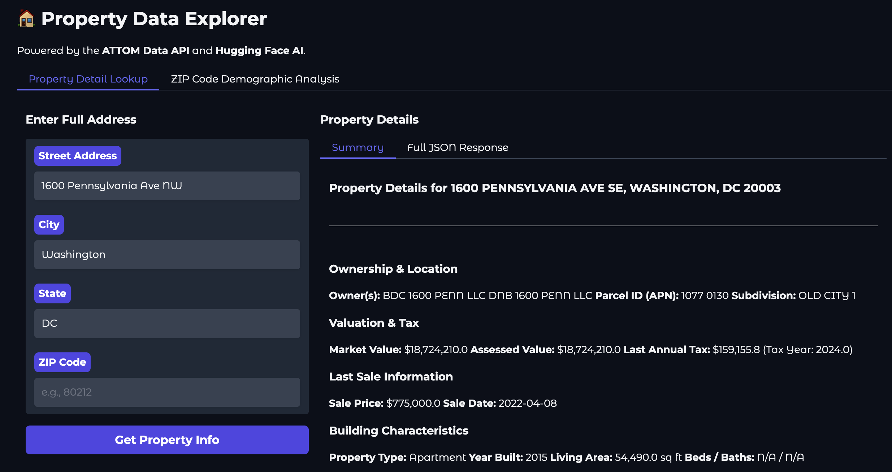

# 🏠 Property Data Explorer & AI Demographic Analyzer 🤖

[](https://huggingface.co/spaces/gaamaa/PropIt)
[](https://opensource.org/licenses/MIT)

An interactive web application that transforms raw property data into actionable insights. This tool harnesses the power of the **ATTOM Data API** for real-time property records and leverages a **Google FLAN-T5 Large Language Model** from the Hugging Face Hub to perform demographic analysis.

---

### Application in Action

| Detailed Property Lookup |
| :---: |
|  | 
| Real-time Analysis | 
|  | 
| Demographic Visualization |
|  | 

---

## ✨ Key Features

This application offers two primary features, accessible through a clean, tabbed interface:

### 1. Detailed Property Lookup
Instantly retrieve a comprehensive profile for any property in the United States. Simply enter a full address to get a detailed report including:
- **Ownership & Location:** Current owner names, Parcel ID (APN), and subdivision details.
- **Valuation & Tax:** The latest market value, assessed value, and annual tax information.
- **Sale History:** The most recent sale price and date.
- **Building Characteristics:** Property type, year built, living area, and bed/bath count.


### 2. AI-Powered Demographic Analysis
Uncover demographic trends within any ZIP code. This feature performs a complex, real-time analysis:
1.  Fetches a sample of 100 Single Family Residences from the ATTOM API based on the user's ZIP code.
2.  Performs a second set of API calls to retrieve the owner's full name for each property.
3.  Uses a **Google FLAN-T5 Large Language Model** to predict the likely national origin of each owner's name.
4.  Generates a dynamic, interactive pie chart visualizing the predicted demographic distribution.


### ⚡️ Advanced Capabilities
- **Efficient Caching:** Implements a persistent, encrypted, file-based cache for both API calls and AI predictions. Subsequent requests for the same data are nearly instantaneous.
- **Real-time Feedback:** A dynamic progress bar and status messages keep the user informed during complex, multi-step analyses.
- **Secure by Design:** All sensitive credentials (API keys, encryption keys) are managed securely using Hugging Face Repository Secrets. Data at rest in the cache is encrypted using the `cryptography` library.

---

## 🛠️ Technology Stack

This application is built with a modern, modular Python stack:

- **Frontend UI:** [Gradio](https://www.gradio.app/)
- **Backend Logic:** Python
- **Data Source:** [ATTOM Data Solutions API](https://api.developer.attomdata.com/)
- **AI / Machine Learning:** [Hugging Face `transformers`](https://huggingface.co/docs/transformers/index) running `google/flan-t5-base`.
- **Data Handling:** [Pandas](https://pandas.pydata.org/) for data manipulation.
- **Plotting:** [Plotly Express](https://plotly.com/python/plotly-express/) for interactive charts.
- **API Communication:** `requests`
- **Security:** `cryptography` for cache encryption.

### Project Structure
The application follows a clean, modular design to separate concerns:
```
/
├── app.py              # Main UI builder and orchestrator
├── requirements.txt      # Project dependencies
└── modules/              # Logic modules
    ├── __init__.py
    ├── attom_api.py      # Handles ATTOM API calls and caching
    ├── ai_analyzer.py    # Handles AI model predictions and caching
    ├── ui_logic.py       # Business logic for each UI tab
    └── cache_handler.py    # Securely encrypts and decrypts cache files
```